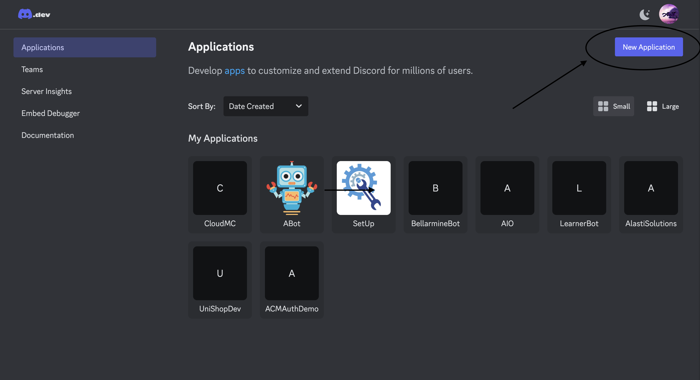
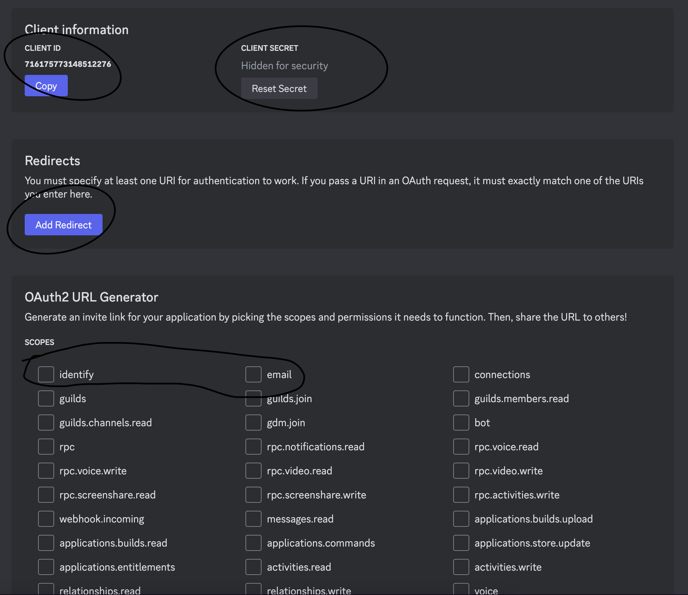

# Running your backend server

#### Set your environment Variables

`JWT_SECRET`, `DISCORD_CLIENT`, `DISCORD_SECRET`

Rename the `.env.example ` file in `mock-backend `to `.env`

#### How to get Discord Client and Secret

1. Visit [Discord Developer](https://discord.com/developers/) and login with your discord account
2. Create New Application

<div align="center">
  
</div>


3. Click on OAuth2

<div align="center">
  
</div>

<div align="center">
  
</div>

4. Copy your Client ID to your to your .env file under `DISCORD_CLIENT="your client here"`
5. Reset your Secret Key then copy the new key to your .env file under `DISCORD_SECRET="your secret here"`
6. Add your redirect URL: `http://localhost:5100/discord/callback`
7. Select the `identify` and `email` scope in the OAuth2 URL generator
8. Scroll down and Save Changes

```bash
npm install

npm start
```
